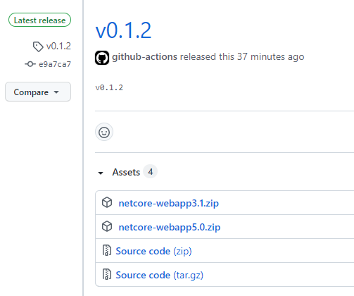

# web-samples-k4apps
Web samples for testing k4apps

## How to add web site sample for one language(PHP/Python/...)

*Suggest using fork repo to verify the support for your language first* 

1. Add new sub folder within `<repo-root>/src`, e.g. **python-webapp**, please append version if multiple versions support are necessory for the language, e.g. **python-webapp2.7**.
1. Copy all source code of one simple web site for the language into folder created in previous step, including one **.gitignore** file for the new language.
1. Add one job in `<repo-root>/.github/workflows/release-build.yml` to build web site added in above step, zip the output and upload the zip as artifact, you may refer the job `build_netcore_app_3_1`.
1. Edit job `create_release`:
    * Add your job name into field `needs`
    * Add one step to download artifact
    ```
      - uses: actions/download-artifact@v2
        with:
          name: python-webapp #same name as using in upload-artifact
          path: zip
    ```
    * Add zip file name to `with.artifacts` for step **ncipollo/release-action@v1.8.10**
1. Adding new tag will trigger the workflow to create a new release against the tag, e.g. new release will be created if adding new tag v0.1.2

 

## How to download the corresponding zip file
The corresponding zip file from latest release will be used for the test, so you may always use the url https://github.com/USER/PROJECT/releases/latest/download/package-name.zip to get latest zip file for one language, e.g. https://github.com/VSChina/web-samples-k4apps/releases/latest/download/netcore-webapp3.1.zip.
